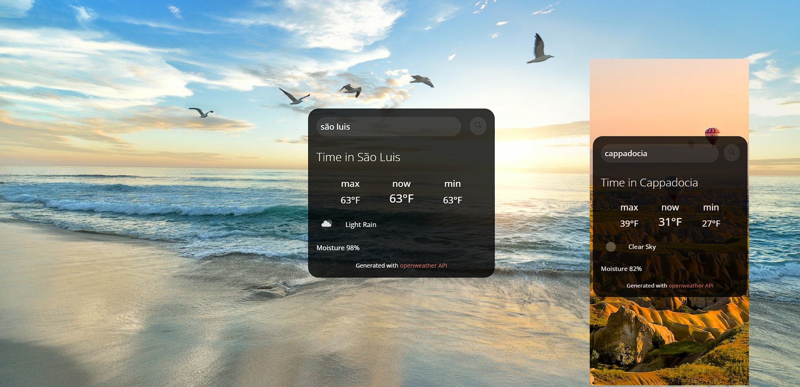

<h1 align="center"> Weather Forecast </h1>

Sistema desenvolvido para aprimorar habilidades em JavaScript.

  <a href="#-tecnologias">Tecnologias</a>&nbsp;&nbsp;&nbsp;|&nbsp;&nbsp;&nbsp;
  <a href="#-projeto">Projeto</a>&nbsp;&nbsp;&nbsp;|&nbsp;&nbsp;&nbsp;
   <a href="#-">Aprendizado</a>&nbsp;&nbsp;&nbsp;|&nbsp;&nbsp;&nbsp;
  <a href="#memo-licença">Licença</a>

  

 

  

## 🚀 Tecnologias

Esse projeto foi desenvolvido com as seguintes tecnologias:

- HTML e CSS
- JavaScript
- Git e Github
- <a href="https://openweathermap.org/">API OpenWeather</a>  
- <a href="https://responsivevoice.org/">API Responsive Voice</a>  

## 💻 Projeto

-Sistema de busca da previsão do tempo com áudio, em cidades de qualquer lugar do mundo .

*Observações:

-O áudio pode não ser compatível com alguns navegadores, (recomendo o uso no Google Chrome PC /Safari no IOS).

-Não deixar espaço após o nome da cidade.

- [Acesse o projeto finalizado, online](https://weather-forecast-livid.vercel.app/)

## 📚 Aprendizado

Na minha jornada de aprendizado em HTML, CSS, JavaScript e APIs, comecei construindo a base com HTML, estilizei com CSS e dei vida à página com JavaScript. Descobri as maravilhas das APIs, ferramentas que tornam tudo mais fácil. Apesar dos desafios, cada pequena vitória é uma motivação para continuar aprendendo e evoluindo na programação web.

## :memo: Licença

Esse projeto está sob a licença MIT.